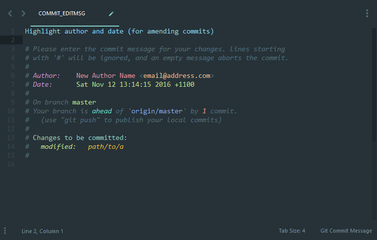
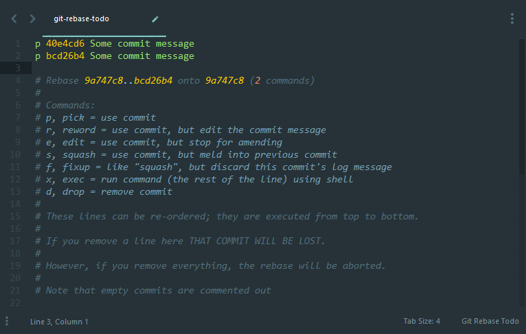

# Commit Message Syntax

Syntax Highlighting for git commit/tag/merge messages (`git commit`, `git tag -a`)

Includes highlighting for:
 - Long Summary Line
 - Text on the second line
 - Comments
 - Long lines
 - Author/Date
 - Branches
 - Status
 - Changes (staged/unstaged/untracked)
 - diff (commit -v)

## Examples

# Interactive Rebase Syntax

Syntax Highlighting for interactive rebase (`git rebase -i`)

## Examples

# Optional/Example Theme Included

Theme based on [Material Theme](https://github.com/equinusocio/material-theme) by Mattia Astorino.

You can use the example [COMMIT_EDITMSG](examples/all-in-one.COMMIT_EDITMSG) and [git-rebase-todo](examples/all-in-one.git-rebase-todo) all-in-one files to fine tune your theme.
